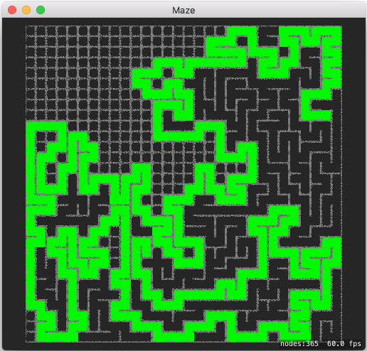
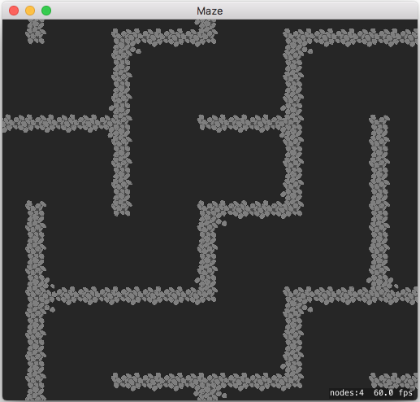
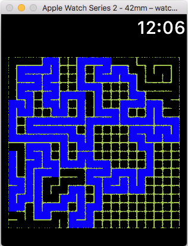
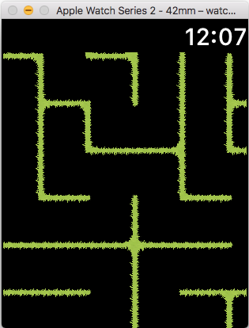

# Maze

# General
Create a maze using SpriteKit and SKTileMapNode iOS, watchOS and macOS variants included

All targets share custom SKTileMapNode named MazeTileMapNode to create the maze using the TileSets. The maze is cut using the Recursive backtracker algorithm. 

Usage: To reset and create a new maze use long press on iOS, force touch menu on watchOS or the "R" key on macOS.

# Screenshots

iPhone video

Visualize the creation of the maze 

Zoom in and scroll inside the generated maze (using Cobblestone TileSet for macOS and iOS)

 

Runs also on watchOS (Using Grass TileSet)
